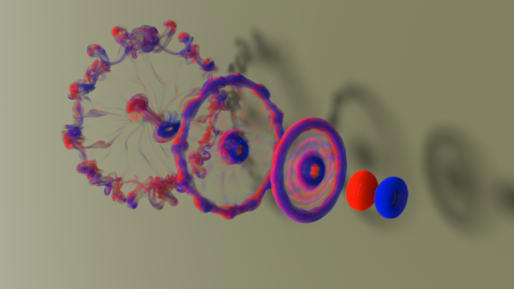

# Efficient and Conservative Fluids with Bidirectional Mapping

[Ziyin Qu*](http://ziyinq.me/)
[Xinxin Zhang*](https://zhxx1987.github.io/)(\*joint first authors)
[Ming Gao](https://www.seas.upenn.edu/~minggao/)
[Chenfanfu Jiang](https://www.seas.upenn.edu/~cffjiang/)
[Baoquan Chen](https://cfcs.pku.edu.cn/baoquan/)

*ACM Transaction on Graphics(Proceedings of SIGGRAPH 2019), 38, 4, 2019*



#### [[Paper](https://www.seas.upenn.edu/~cffjiang/research/qu2019advection/qu2019advection.pdf)] [[Video](https://www.youtube.com/watch?v=dDB3xhy55P8)]

## Abstract
In this paper, we introduce **BiMocq<sup>2</sup>**, an unconditionally stable, pure Eulerian-based advection scheme to efficiently preserve the advection accuracy of all physical quantities for long-term fluid simulations. Our approach is built upon the method of characteristic mapping (MCM). Instead of the costly evaluation of the temporal characteristic integral, we evolve the mapping function itself by solving an advection equation for the mappings. Dual mesh characteristics (DMC) method is adopted to more accurately update the mapping.
Furthermore, to avoid visual artifacts like instant blur and temporal inconsistency introduced by re-initialization, we introduce multi-level mapping and back and forth error compensation.
We conduct comprehensive 2D and 3D benchmark experiments to compare against alternative advection schemes.
In particular, for the vortical flow and level set experiments, our method outperforms almost all state-of-art hybrid schemes, including FLIP, PolyPic and Particle-Level-Set, at the cost of only two Semi-Lagrangian advections. 
Additionally, our method does not rely on the particle-grid transfer operations, leading to a highly parallelizable pipeline. 
As a result, more than $45\times$ performance acceleration can be achieved via even a straightforward porting of the code from CPU to GPU.

## Compile and Run
To build this project, you will need tbb, openvdb, boost, and CUDA as dependencies.
```
sudo apt-get install libtbb-dev libopenvdb-dev libboost-all-dev
```
This code is built and tested on Ubuntu 16.04 and 18.04, and tested with SM_6X GPUs and above.

2D code and 3D code are seperated, you can execute them seperately. For 2D code, you should specify simulation method as the second input parameter. 0~7 are Semi-Lagrangian, MacCormack, BFECC, Mac_Reflection, FLIP, APIC, PolyPIC, BiMocq method respectively.
```
mkdir build
cd build && cmake ..
make
./BIMOCQ2D sim_method
./BIMOCQ2D
```
Generated .vdb file will be located in BIMOCQ/Out folder, you can use any software(e.g. Houdini) to visualize.
## BibTex 

Please cite the following paper if it helps. 

```
@article{Qu:2019:bimocq,
 author       = {Ziyin Qu* and Xinxin Zhang* and Ming Gao and Chenfanfu Jiang and Baoquan Chen},
 title        = {Efficient and Conservative Fluids with Bidirectional Mapping},
 journal      = {ACM Transactions on Graphics (Proceedings of SIGGRAPH 2019)},
 volume       = {38},  
 number       = {4},  
 year         = {2019},   
 publisher    = {ACM Press},
 address      = {New York, NY, USA},
 note         = {(*Joint First Authors)},
}  
```